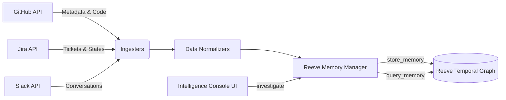

# Reeve Enterprise: The AI Detective for Your Engineering Org 🕵️‍♂️

**Reeve Enterprise** is a powerful AI intelligence console designed for **Root Cause Analysis (RCA)** and tracing the origination patterns of software issues. By fusing your organization's scattered data into a single temporal knowledge graph, it acts as an autonomous detective that traces bugs from their origination in a Jira ticket, through the GitHub pull request, all the way down to the exact lines of flawed logic in the raw source code.

---

## 🏆 What Makes Us Different?

Most "AI coding assistants" just chat with your codebase. **Reeve Enterprise does not just chat—it detects traces and uncovers origination patterns.**

*   **Cross-Domain Intelligence**: It doesn't just read code. It reads your Jira tickets, GitHub PRs, and Slack conversations, understanding *why* code was written, not just *how*.
*   **Automatic Pattern Recognition**: Our backend automatically wraps your natural language queries to force the AI to cross-reference bugs with source code. It finds the "DNA" of an issue across multiple platforms.
*   **Temporal Knowledge Graph**: Powered by the Reeve SDK, it understands the *timeline* of events. It knows that a bug reported on Tuesday was caused by a PR merged on Monday, which was requested in a Jira ticket on Friday.
*   **Zero Context Switching**: Everything is synthesized into a single, beautiful Intelligence Console. You don't need to open Jira, GitHub, and your IDE simultaneously anymore.

---

## ✨ Key Features

*   **🧠 Multi-Source Ingestion**: Automatically pulls in data from **GitHub** (PRs, issues, commits, codebase), **Jira** (tickets, state changes), and **Slack** (conversations).
*   **💻 Live Codebase Integration**: Fetches and stores the actual raw source code of your repositories directly from the GitHub API.
*   **🔍 Investigative UI**: A beautifully designed frontend (`query_interface.html`) featuring a native File Browser and full Markdown rendering.
*   **🕵️‍♂️ Origination Tracing**: Ask "Why does train_safeppo.py crash?" and watch it pull the exact Jira bug report and highlight the flawed Python logic in one unified answer.

---

## 🚀 Quick Start (Hackathon Guide)

### 1. Prerequisites
*   Python 3.10+
*   API keys for:
    *   **Reeve**: https://mcp.reeve.co.in
    *   **GitHub**: Personal access token
    *   **Jira**: API token + account email

### 2. Installation
```bash
# Clone/setup project
git clone <your-repo>
cd reeve-enterprise

# Install dependencies
pip install -r requirements.txt

# Copy environment template
cp .env.example .env
```

### 3. Configure `.env`
Edit `.env` with your credentials:
```env
REEVE_API_KEY=sk-your-key
GITHUB_TOKEN=ghp_your-token
GITHUB_OWNER=your-org
GITHUB_REPOS=your-repo

JIRA_URL=https://your-org.atlassian.net
JIRA_USERNAME=email@company.com
JIRA_API_TOKEN=your-token
JIRA_PROJECTS=KAN
```

### 4. Start the Engine
Start the backend FastAPI server:
```bash
python -m uvicorn main:app --reload --port 8000
```
Open **`query_interface.html`** in your web browser to access the Intelligence Console!

---

## 🛠️ Usage & Ingestion

Before you can investigate, you need to ingest your organization's data into the Reeve knowledge graph. We provide a powerful CLI for this:

```bash
# 1. Ingest all GitHub Metadata (PRs, Issues, Commits)
python cli.py ingest github

# 2. Ingest the raw Codebase (Files & Source Code)
python cli.py ingest codebase

# 3. Ingest Jira Tickets
python cli.py ingest jira
```

### Using the Intelligence Console
Once ingested, simply open `query_interface.html`. 

**1. Browse Files**: Click the "Browse Files" button in the sidebar to natively navigate your GitHub repository's file tree and view source code with syntax highlighting.
**2. Trace Patterns**: Use the query bar to run RCA investigations:
*   *"What are the open bugs in Jira right now, and which specific Python files in the codebase do they affect?"*
*   *"Trace the origination pattern for the division by zero crash. Which Jira ticket tracks it, and what's the root cause in the code?"*

---

## 🏗️ Architecture



1.  **Ingesters (`ingester_*.py`)**: Connect to external APIs (GitHub, Jira, Codebase) and extract raw data.
2.  **Normalizers (`models.py`)**: Convert disparate data structures into a unified `NormalizedEvent` format.
3.  **Reeve Memory Manager (`memory_manager.py`)**: Pushes normalized events to the Reeve Temporal Graph and enhances user queries to force cross-domain pattern matching.
4.  **FastAPI Backend (`main.py`)**: Serves the REST API for the UI.
5.  **Intelligence Console (`query_interface.html`)**: The frontend interface for engineers to conduct investigations.

---

## 🔮 Future Roadmap
*   **Real-time Webhooks**: Automatically ingest new Jira tickets and GitHub commits the second they happen.
*   **Multi-tenant Support**: Allow multiple organizations to use the console securely.
*   **Automated PR Generation**: Once an origination pattern is found, automatically draft a GitHub PR to fix the root cause.
