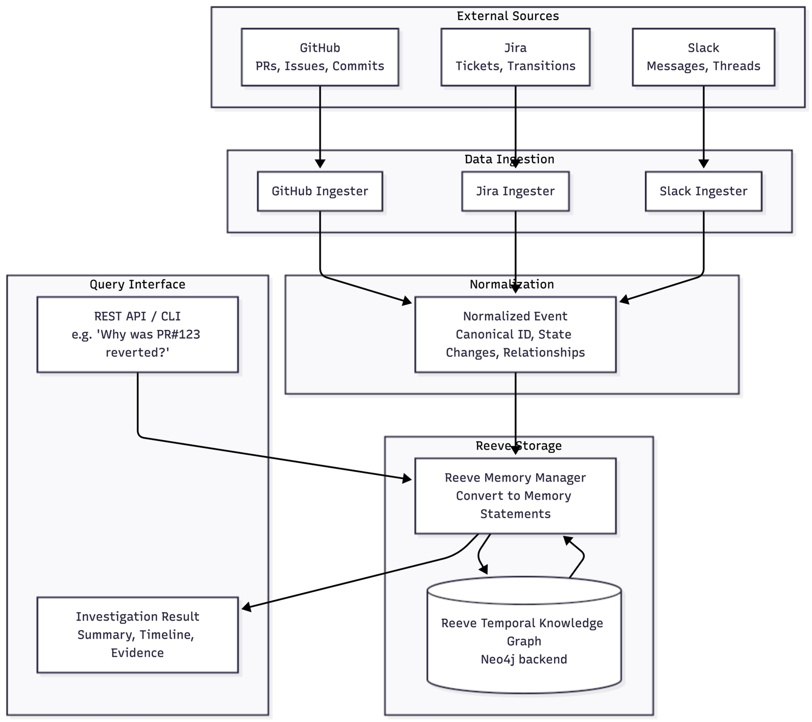

# 🕵️ Reeve Enterprise

## The AI Detective for Engineering Organizations

### Stop Searching. Start Investigating.

Modern engineering teams generate thousands of signals every week:

* Jira tickets
* GitHub commits & pull requests
* Slack discussions
* Code reviews
* Production incidents

When a critical bug appears, engineers waste hours jumping between tools trying to answer one question:

> **"Where did this issue actually originate?"**

**Reeve Enterprise** transforms organizational knowledge into a unified temporal intelligence graph and autonomously performs Root Cause Analysis across your entire engineering ecosystem.

Instead of searching repositories, tickets, and conversations individually, engineers can investigate issues through a single AI-powered console that reconstructs the complete chain of events leading to a failure.

---

# 🚀 What Makes Reeve Different?

Most AI developer tools answer questions about code.

**Reeve answers questions about causality.**

It doesn't just understand what code exists.

It understands:

* Why it was written
* Who requested it
* Which ticket introduced it
* Which discussion influenced it
* Which commit changed it
* Which PR merged it
* How it ultimately caused a production issue

By connecting organizational knowledge into a temporal graph, Reeve behaves like an AI investigator rather than a chatbot.

---

# 🧠 Core Innovation

### Temporal Engineering Intelligence Graph

Reeve continuously builds relationships between:

```text
Jira Ticket
      ↓
Slack Discussion
      ↓
GitHub Pull Request
      ↓
Commit History
      ↓
Source Code
      ↓
Production Bug
```

Unlike traditional RAG systems that retrieve isolated documents, Reeve reconstructs the entire lifecycle of engineering decisions.

This allows the system to identify not only *where* a bug exists, but *how it evolved into existence*.

---

# ⚡ Key Capabilities

## 🔍 Autonomous Root Cause Analysis

Ask:

> "Why does train_safeppo.py crash during evaluation?"

Reeve automatically:

* Finds related Jira tickets
* Retrieves associated GitHub PRs
* Analyzes commits that modified the file
* Examines Slack discussions surrounding the change
* Locates the exact code responsible
* Produces a complete investigation report

---

## 🧩 Cross-Domain Correlation

Most tools operate in silos.

Reeve correlates evidence across:

* GitHub
* Jira
* Slack
* Source Code

This enables true engineering intelligence rather than isolated search.

---

## 📈 Organizational Memory

Engineering knowledge is often lost when people switch teams or leave companies.

Reeve creates a persistent institutional memory that preserves:

* Design decisions
* Technical discussions
* Incident histories
* Feature evolution

---

## 💻 Live Repository Intelligence

Reeve ingests:

* Repositories
* Pull Requests
* Issues
* Commits
* Full Source Code

allowing investigations down to individual functions and code blocks.

---

## 🎯 Natural Language Investigations

Examples:

```text
Which open Jira bugs affect the PPO training pipeline?

What code changes introduced the collision-rate regression?

Show me all PRs related to Safe PPO reward shaping.

Which engineer discussions led to this implementation?
```

---

# 🏗️ System Architecture



---

# 🛠 Technology Stack

### Backend

* FastAPI
* Python
* Reeve SDK
* Async Processing

### Data Sources

* GitHub API
* Jira API
* Slack API

### Intelligence Layer

* Temporal Knowledge Graph
* Cross-Domain Retrieval
* Organizational Memory
* RCA Agent

### Frontend

* Interactive Investigation Console
* Markdown Rendering
* Repository File Explorer
* Source-Code Viewer

---

# ⚙️ Quick Start

## Clone Repository

```bash
git clone <repo-url>
cd reeve-enterprise
```

## Install Dependencies

```bash
pip install -r requirements.txt
```

## Configure Environment

```env
REEVE_API_KEY=your_key

GITHUB_TOKEN=your_token
GITHUB_OWNER=your_org
GITHUB_REPOS=repo1,repo2

JIRA_URL=https://your-company.atlassian.net
JIRA_USERNAME=your_email
JIRA_API_TOKEN=your_token

SLACK_BOT_TOKEN=xoxb-token
```

## Start Backend

```bash
uvicorn main:app --reload --port 8000
```

## Launch Intelligence Console

Open:

```text
query_interface.html
```

---

# 📥 Data Ingestion

### GitHub Metadata

```bash
python cli.py ingest github
```

### Full Codebase

```bash
python cli.py ingest codebase
```

### Jira Tickets

```bash
python cli.py ingest jira
```

### Slack Conversations

```bash
python cli.py ingest slack
```

---

# 🎬 Example Investigation

### Query

```text
Why did the PPO safety agent start tailgating after Release v2.1?
```

### Reeve Investigation

✔ Finds related Jira ticket

✔ Retrieves linked PR

✔ Identifies commit introducing reward-function change

✔ Extracts Slack discussion about the modification

✔ Highlights affected code region

✔ Generates root-cause explanation

### Result

```text
Issue Origin:
JIRA-241

Introduced By:
PR #487

Commit:
d9a4f72

Root Cause:
Safety penalty weight reduced from 0.5 → 0.1,
causing unsafe optimization behavior in dense traffic scenarios.
```

---

# 🏆 Hackathon Impact

### Engineering teams spend hours finding causes.

Reeve finds them in seconds.

By transforming fragmented engineering data into a connected intelligence graph, Reeve enables:

* Faster incident response
* Reduced debugging time
* Better organizational memory
* Cross-team knowledge discovery
* AI-powered engineering investigations

---

# 🔮 Future Roadmap

### Real-Time Intelligence

* GitHub Webhooks
* Jira Event Streaming
* Slack Event Subscriptions

### Autonomous Engineering Agents

* Automated Incident Investigations
* PR Risk Assessment
* Change Impact Analysis
* AI-Generated Fix Suggestions

### Enterprise Scale

* Multi-Tenant Deployments
* Role-Based Access Control
* Audit Trails
* Compliance Support

---

## Built with Reeve SDK

**Reeve Enterprise turns organizational knowledge into engineering intelligence.**
